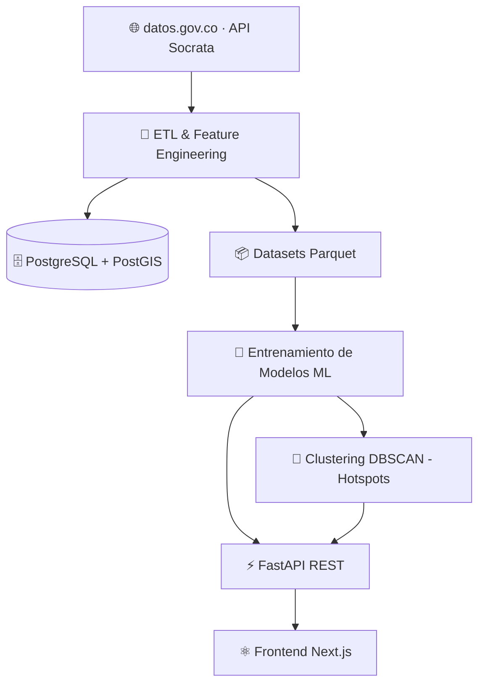

<div align="center">


<br/>


<br/>


<br/><br/>

### 🛡️ Plataforma Nacional Inteligente para la Predicción y Análisis de Criminalidad
*mediante Inteligencia Artificial y Datos Abiertos de Colombia* 🇨🇴

</div>

---

## 📌 Tabla de Contenidos

- [🎯 Objetivo](#-objetivo)
- [🏗️ Arquitectura](#️-arquitectura)
- [🧠 Modelo de Machine Learning](#-modelo-de-machine-learning)
- [📊 Variables Utilizadas](#-variables-utilizadas)
- [📁 Estructura del Proyecto](#-estructura-del-proyecto)
- [🗃️ Datasets Oficiales](#️-datasets-oficiales)
- [🚀 Instalación](#-instalación-y-ejecución)
- [🔌 API Endpoints](#-api-endpoints)
- [🐳 Docker](#-docker)
- [🧪 Tests](#-tests)
- [📊 Stack Tecnológico](#-stack-tecnológico)

---

## 🎯 Objetivo

Integrar **datos abiertos** y **machine learning supervisado** en una plataforma de escala nacional para predecir, analizar y visualizar patrones de criminalidad en Colombia en tiempo real, identificando zonas de alto riesgo delictivo mediante clasificación binaria y agrupamiento espacial no supervisado.

---

## 🏗️ Arquitectura



**Backend:** FastAPI (Python 3.12) desplegado en AWS EC2 + Nginx como reverse proxy.
**Frontend:** Next.js 16 / React 19, desplegado en Vercel.
**Modelos:** entrenados offline con scikit-learn y XGBoost, serializados en `.joblib` y servidos vía inferencia en tiempo real desde la API.

---

## 🧠 Modelo de Machine Learning

PIPAC aborda el problema como una **tarea de clasificación binaria supervisada**: predecir si una zona/territorio es de **riesgo delictivo alto** (`es_riesgo_alto = 1`) o **no** (`es_riesgo_alto = 0`), en función de la densidad histórica de eventos delictivos.

### Variable objetivo (target)

| Variable | Tipo | Definición |
|---|---|---|
| `es_riesgo_alto` | Binaria (0/1) | Se etiqueta como riesgo alto si `densidad_eventos_30d` supera la mediana histórica de la zona |

### Algoritmos entrenados y comparados

Se entrenan y comparan **4 modelos de clasificación** sobre el mismo pipeline de preprocesamiento, seleccionando el de mejor desempeño para servir en producción:

| Modelo | Algoritmo | Librería | Hiperparámetros clave |
|---|---|---|---|
| `logistic` | Regresión Logística | scikit-learn | `max_iter=1000`, `class_weight="balanced"` |
| `dt` | Árbol de Decisión | scikit-learn | `max_depth=10`, `class_weight="balanced"` |
| `rf` | Random Forest | scikit-learn | `n_estimators=100`, `class_weight="balanced"` |
| `xgb` | XGBoost Classifier | XGBoost | `n_estimators=100`, `max_depth=5`, `learning_rate=0.05`, `subsample=0.8`, `colsample_bytree=0.8` |

Todos usan `random_state=42` para reproducibilidad y balanceo de clases (`class_weight="balanced"`) para compensar el desbalance entre zonas de riesgo alto/bajo.

### Pipeline de preprocesamiento (`ColumnTransformer`)

- **Variables numéricas:** imputación por mediana (`SimpleImputer(strategy="median")`)
- **Variables categóricas:** imputación por moda + codificación one-hot (`OneHotEncoder(handle_unknown="ignore")`)
- **División de datos:** `train_test_split` 80/20, estratificado por la variable objetivo (`stratify=y`)

### Métricas de evaluación

Cada modelo se evalúa con: `accuracy`, `precision`, `recall`, `f1-score`, `ROC-AUC` y matriz de confusión completa (TN, FP, FN, TP), almacenadas en `models/{modelo}.metrics.json`.

> ⚠️ **Nota técnica:** en el entrenamiento actual todos los modelos alcanzan métricas perfectas (1.0 en las 5 métricas). Esto es indicio de **fuga de datos (data leakage)**, ya que la variable objetivo se deriva directamente de `densidad_eventos_30d`, la cual también se usa como variable predictora. Antes de usar estas métricas como evidencia de desempeño real (por ejemplo en un sustentación o demo formal), se recomienda excluir `densidad_eventos_30d` del conjunto de variables predictoras o redefinir el target a partir de una variable independiente.

### Modelo no supervisado adicional: detección de hotspots

Además de la clasificación, se usa **DBSCAN** (`sklearn.cluster`) para agrupar geográficamente eventos delictivos y detectar zonas calientes ("hotspots"):

- `eps_km = 1.5` (radio a escala nacional) / `0.5` (escala municipal)
- `min_samples = 10`
- Artefacto serializado: `models/dbscan_hotspots.joblib`

---

## 📊 Variables Utilizadas

El modelo utiliza **11 variables predictoras** (7 categóricas + 4 numéricas), seleccionadas dinámicamente según disponibilidad en el dataset:

### Variables categóricas (7) — codificadas con One-Hot Encoding

| # | Variable | Descripción |
|---|---|---|
| 1 | `tipo_delito` | Categoría del delito reportado |
| 2 | `barrio` | Barrio o unidad territorial de menor escala |
| 3 | `comuna` | Comuna/municipio o departamento |
| 4 | `zona_tipo` | Clasificación de zona (residencial, comercial, etc.) |
| 5 | `mes` | Mes del evento (1-12) |
| 6 | `dia_semana` | Día de la semana (0-6) |
| 7 | `hora` | Hora del día del evento (0-23) |

### Variables numéricas (4) — imputadas con la mediana

| # | Variable | Descripción |
|---|---|---|
| 8 | `densidad_eventos_30d` | Suma de eventos delictivos en ventana móvil de 30 días por barrio |
| 9 | `tasa_crimen_1000` | Tasa de criminalidad por cada 1,000 habitantes |
| 10 | `poblacion_total` | Población total del territorio (cruce con datos DANE/proyección poblacional) |
| 11 | `movilidad_intensidad` | Proxy de movilidad, calculado como conteo de accidentes de tránsito por zona |

### Variables temporales adicionales generadas en el ETL (no todas usadas como predictoras directas)

`anio`, `dia`, `semana_anio`, `es_fin_de_semana` — generadas en `preprocessing/features.py::build_temporal_features` para análisis exploratorio y dashboards, aunque no todas entran al pipeline de entrenamiento actual.

---

## 📁 Estructura del Proyecto
PIPAC/
├── api/ → FastAPI: endpoints REST (main.py, routes/)
├── frontend/ → Next.js 16 + React 19 (desplegado en Vercel)
├── preprocessing/ → ETL: limpieza, features, homologación territorial
├── training/ → Entrenamiento de modelos (train.py, hotspots.py)
├── src/ → Módulos auxiliares de pipeline e integración ML
├── models/ → Modelos serializados (.joblib) + métricas (.json)
├── modules/latest_reports/ → Módulo de últimas denuncias nacionales
├── database/ → Esquema SQL (schema.sql)
├── datasets/ → raw/, processed/
├── notebooks/ → Análisis exploratorio Jupyter (EDA, limpieza, modelo, reportes)
├── scripts/ → Migración PostGIS, ETL nacional
├── tests/ → Suite de pruebas (API, inferencia, calidad de datos, smoke)
├── config/ → Configuración y settings (settings.py)
├── Dockerfile.api / Dockerfile.dashboard
├── docker-compose.yml
├── .env.example
├── requirements.txt
└── README.md

---

## 🗃️ Datasets Oficiales

> 📡 Todos los datos provienen del portal oficial [datos.gov.co](https://www.datos.gov.co/)

| # | Dataset | Categoría | Enlace |
|---|---|---|---|
| 1 | Información Delictiva Municipal Histórica | Seguridad | [Ver](https://www.datos.gov.co/Seguridad-y-Defensa/Informaci-n-delictiva-del-municipio-de-Bucaramanga/x46e-abhz) |
| 2 | Reporte Hurto por Modalidades — Policía Nacional | Seguridad | [Ver](https://www.datos.gov.co/Seguridad-y-Defensa/Reporte-Hurto-por-Modalidades-Polic-a-Nacional/d4fr-sbn2) |
| 3 | Accidentes de Tránsito Municipales | Transporte | [Ver](https://www.datos.gov.co/Transporte/3-Accidentes-de-Transito-ocurridos-en-el-Municipio/7cci-nqqb) |
| 4 | Proyección Población Municipal | Territorio | [Ver](https://www.datos.gov.co/Vivienda-Ciudad-y-Territorio/Datos-de-proyecci-n-de-poblaci-n-de-Bucaramanga-de/kn95-8dei) |
| 5 | Gran Encuesta Integrada de Hogares — GEIH 2026 | Socioeconómico | [Ver](https://www.datos.gov.co/dataset/Gran-Encuesta-Integrada-de-Hogares-GEIH-2026/nzxb-qax7) |
| 6 | Cartografía Urbana Catastral — Bucaramanga | GeoEspacial | [Ver](https://www.datos.gov.co/Vivienda-Ciudad-y-Territorio/23-Cartograf-a-Urbana-Catastral-en-formato-geoData/f4hz-53x5) |
| 7 | Tráfico Vehicular ANI | Transporte | [Ver](https://www.datos.gov.co/Transporte/Tr-fico-Vehicular-ANI/8yi9-t44c) |

---

## 🚀 Instalación y Ejecución

```bash
# 1. Clonar
git clone https://github.com/JuanDavid-dev-lang/PIPAC.git
cd PIPAC

# 2. Entorno virtual
python -m venv venv
source venv/bin/activate   # Linux/macOS
venv\Scripts\activate      # Windows
pip install -r requirements.txt

# 3. Variables de entorno
cp .env.example .env

# 4. Levantar API
uvicorn api.main:app --reload --host 0.0.0.0 --port 8000
# → http://127.0.0.1:8000/docs

# 5. Entrenar modelos (opcional, ya vienen pre-entrenados en /models)
python -m training.train
```

---

## 🔌 API Endpoints

| Método | Endpoint | Descripción |
|---|---|---|
| `GET` | `/health` | Estado del sistema |
| `GET` | `/api/v1/crimes` | Datos de criminalidad |
| `GET` | `/api/v1/predictions` | Predicciones de riesgo por territorio |
| `GET` | `/api/v1/predictions/risk-map` | Mapa de riesgo (Heatmap GeoJSON) |
| `GET` | `/api/v1/predictions/alerts` | Alertas predictivas generadas por IA |
| `GET` | `/api/v1/predictions/trend` | Proyección de tendencias por ML |
| `GET` | `/api/v1/stats` | Estadísticas agregadas |
| `GET` | `/api/v1/alerts` | Alertas activas |
| `POST` | `/api/v1/datasets/refresh/local` | Refrescar datasets localmente |

> 📖 Documentación interactiva en `/docs` (Swagger UI)

---

## 🐳 Docker

```bash
docker-compose up --build
```

---

## 🧪 Tests

```bash
pytest tests/ -v
```

---

## 📊 Stack Tecnológico

| Capa | Tecnología |
|---|---|
| Lenguaje | Python 3.12 |
| API | FastAPI + Uvicorn |
| Frontend | Next.js 16, React 19, Tailwind CSS |
| ML — Clasificación | Logistic Regression, Decision Tree, Random Forest, XGBoost (scikit-learn / xgboost) |
| ML — Clustering | DBSCAN (scikit-learn) |
| Base de Datos | PostgreSQL + PostGIS |
| Datos | Pandas, PyArrow (Parquet) |
| Contenedores | Docker + Docker Compose |
| Datos Abiertos | Socrata API (datos.gov.co) |

---

<div align="center">

### 🇨🇴 Hecho con ❤️ para Colombia

⭐ **¡Dale una estrella si te sirve!** ⭐

</div>
