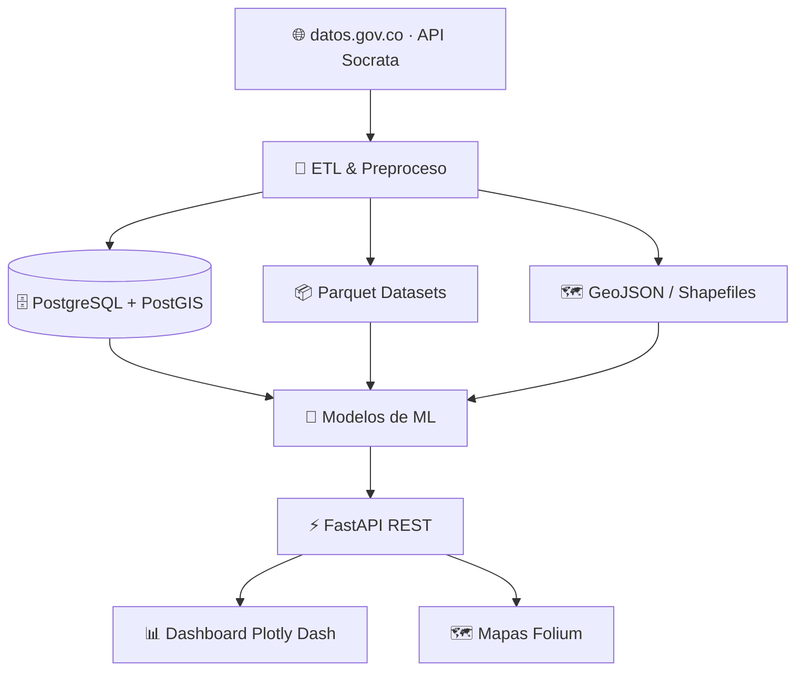

<div align="center">


<br/>


<br/>


<br/><br/>

### 🛡️ Plataforma Nacional Inteligente para la Predicción y Análisis de Criminalidad
*mediante Inteligencia Artificial y Datos Abiertos de Colombia* 🇨🇴

</div>

---

## 📌 Tabla de Contenidos

- [🎯 Objetivo](#-objetivo)
- [⚡ Características](#-características)
- [🏗️ Arquitectura](#️-arquitectura)
- [📁 Estructura del Proyecto](#-estructura-del-proyecto)
- [🗃️ Datasets Oficiales](#️-datasets-oficiales)
- [🚀 Instalación](#-instalación-y-ejecución)
- [🔌 API Endpoints](#-api-endpoints)
- [🗺️ Visualizaciones](#️-visualizaciones-y-mapas)
- [🐳 Docker](#-docker)
- [🧪 Tests](#-tests)
- [📊 Tecnologías](#-tecnologías)

---

## 🎯 Objetivo

Integrar **datos abiertos** y **machine learning** en una plataforma de escala nacional para predecir, analizar y visualizar patrones de criminalidad en Colombia, en tiempo real.

| Módulo | Descripción |
|---|---|
| 📥 Ingesta de Datos | Recolección automática desde datos.gov.co vía API Socrata |
| 🔧 ETL & Homologación | Limpieza, normalización y homologación territorial municipal |
| 🧠 Feature Engineering | Ingeniería de características criminológicas avanzadas |
| 🤖 Modelos de ML | Random Forest, XGBoost, LSTM y más |
| ⚡ API REST | FastAPI con documentación Swagger/OpenAPI |
| 🗺️ Dashboard | Mapas Folium + KPIs en tiempo real con Plotly Dash |
| 🗄️ Base Espacial | PostgreSQL + PostGIS |

---

## ⚡ Características

- ✅ Datos oficiales de datos.gov.co
- ✅ ETL automatizado y escalable
- ✅ Modelos ML entrenados y versionados
- ✅ Alertas tempranas de zonas de riesgo
- ✅ Cobertura nacional Colombia
- ✅ API REST moderna con Swagger
- ✅ Mapas geoespaciales interactivos
- ✅ Dashboard interactivo en tiempo real
- ✅ Exportación múltiple (csv/json/xlsx)
- ✅ Totalmente Dockerizado

---

## 🏗️ Arquitectura



---

## 📁 Estructura del Proyecto

```
PIPAC/
├── api/                 → FastAPI: endpoints REST
├── dashboard/           → Plotly Dash: visualización interactiva
├── preprocessing/       → ETL: limpieza y transformación
├── training/            → Entrenamiento de modelos ML
├── models/               → Modelos serializados (.pkl, .joblib)
├── datasets/
│   ├── raw/
│   └── processed/
├── maps/                 → Mapas Folium y GeoJSON
├── notebooks/             → Análisis exploratorio Jupyter
├── config/                → Configuración y settings
├── utils/                  → Utilidades compartidas
├── scripts/                 → Scripts de migración y admin
├── tests/                    → Suite de pruebas
├── documentation/              → Documentación técnica
├── Dockerfile.api
├── Dockerfile.dashboard
├── docker-compose.yml
├── .env.example
├── requirements.txt
└── README.md
```

---

## 🗃️ Datasets Oficiales

> 📡 Todos los datos provienen del portal oficial [datos.gov.co](https://www.datos.gov.co/)

| # | Dataset | Categoría | Enlace |
|---|---|---|---|
| 1 | Información Delictiva Municipal Histórica | Seguridad | [Ver](https://www.datos.gov.co/Seguridad-y-Defensa/Informaci-n-delictiva-del-municipio-de-Bucaramanga/x46e-abhz) |
| 2 | Reporte Hurto por Modalidades — Policía Nacional | Seguridad | [Ver](https://www.datos.gov.co/Seguridad-y-Defensa/Reporte-Hurto-por-Modalidades-Polic-a-Nacional/d4fr-sbn2) |
| 3 | Accidentes de Tránsito Municipales | Transporte | [Ver](https://www.datos.gov.co/Transporte/3-Accidentes-de-Transito-ocurridos-en-el-Municipio/7cci-nqqb) |
| 4 | Proyección Población Municipal | Territorio | [Ver](https://www.datos.gov.co/Vivienda-Ciudad-y-Territorio/Datos-de-proyecci-n-de-poblaci-n-de-Bucaramanga-de/kn95-8dei) |
| 5 | Gran Encuesta Integrada de Hogares — GEIH 2026 | Socioeconómico | [Ver](https://www.datos.gov.co/dataset/Gran-Encuesta-Integrada-de-Hogares-GEIH-2026/nzxb-qax7) |
| 6 | Cartografía Urbana Catastral — Bucaramanga | GeoEspacial | [Ver](https://www.datos.gov.co/Vivienda-Ciudad-y-Territorio/23-Cartograf-a-Urbana-Catastral-en-formato-geoData/f4hz-53x5) |
| 7 | Tráfico Vehicular ANI | Transporte | [Ver](https://www.datos.gov.co/Transporte/Tr-fico-Vehicular-ANI/8yi9-t44c) |

---

## 🚀 Instalación y Ejecución

**Prerequisitos:** Python 3.12+, PostgreSQL 14+ con PostGIS (opcional), Docker & Docker Compose.

### ⚡ Inicio rápido (Windows)
```batch
iniciar.bat
```

### 🐍 Manual

```bash
# 1. Clonar
git clone https://github.com/JuanDavid-dev-lang/PIPAC.git
cd PIPAC

# 2. Entorno virtual
python -m venv .venv
.venv\Scripts\activate      # Windows
source .venv/bin/activate   # Linux/macOS
pip install -r requirements.txt

# 3. Variables de entorno
copy .env.example .env      # Windows
cp .env.example .env        # Linux/macOS

# 4. Levantar API
uvicorn api.main:app --reload --host 0.0.0.0 --port 8000
# → http://127.0.0.1:8000  |  Docs: /docs

# 5. Levantar Dashboard
python -m dashboard.app
# → http://127.0.0.1:8050

# 6. Generar mapas
python -m maps.generate_maps
# → maps/output/
```

---

## 🔌 API Endpoints

| Método | Endpoint | Descripción |
|---|---|---|
| `GET` | `/health` | Estado del sistema |
| `GET` | `/api/v1/crimes` | Datos de criminalidad |
| `GET` | `/api/v1/predictions` | Predicciones de ML |
| `GET` | `/api/v1/stats` | Estadísticas agregadas |
| `GET` | `/api/v1/alerts` | Alertas activas |
| `POST` | `/api/v1/datasets/refresh` | Refrescar datasets |
| `POST` | `/api/v1/train` | Entrenar modelos |
| `GET` | `/api/v1/export/{format}` | Exportar datos (csv/json/xlsx) |

> 📖 Documentación interactiva en `/docs` (Swagger UI) y `/redoc`

---

## 🗺️ Visualizaciones y Mapas

- 🔴 Heatmaps de criminalidad por municipio y departamento
- 📍 Puntos de incidentes geolocalizados
- 🔵 Zonas de alto riesgo predichas por ML
- 📈 KPIs en tiempo real: tasa delictiva, variación mensual, hotspots
- 🗺️ Capas GeoJSON con división político-administrativa de Colombia

---

## 🐳 Docker

```bash
docker-compose up --build      # Todos los servicios
docker-compose up api          # Solo API
docker-compose up dashboard    # Solo dashboard
```

| Servicio | Puerto | URL |
|---|---|---|
| API FastAPI | `8000` | http://localhost:8000/docs |
| Dashboard | `8050` | http://localhost:8050 |
| PostgreSQL | `5432` | localhost:5432 |

---

## 🗄️ Migraciones PostGIS

```bash
pip install psycopg2-binary
python scripts/migrate_postgis.py
```

---

## 📥 Ejecutar ETL

```bash
curl -X POST http://127.0.0.1:8000/api/v1/datasets/refresh/local
```
> Los datasets se guardan en `datasets/processed/` como `.parquet`

---

## 🧪 Tests

```bash
pytest tests/ -v
pytest tests/ --cov=api --cov-report=html
```

---

## 📊 Tecnologías

| Capa | Tecnología |
|---|---|
| Lenguaje | Python 3.12 |
| API | FastAPI + Uvicorn |
| Dashboard | Plotly Dash |
| ML | scikit-learn, XGBoost, statsmodels |
| Mapas | Folium, GeoPandas |
| Base de Datos | PostgreSQL + PostGIS |
| Datos | Pandas, Polars, PyArrow (Parquet) |
| Contenedores | Docker + Docker Compose |
| Datos Abiertos | Socrata API (datos.gov.co) |

---

## 📝 Notas del Dashboard

Orden de carga de datos:
1. `datasets/processed/crime_hurtos_nacional_featured.parquet`
2. `datasets/processed/crime_hurtos_nacional.parquet`
3. `datasets/processed/crime_bga.parquet`
4. API local → `/api/v1/crimes`
5. Datos de demostración simulados (fallback)

---

<div align="center">

### 🇨🇴 Hecho con ❤️ para Colombia
*Contribuyendo a la seguridad ciudadana mediante tecnología e inteligencia artificial*


⭐ **¡Dale una estrella si te sirve!** ⭐

</div>
